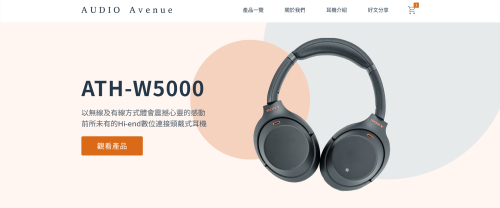
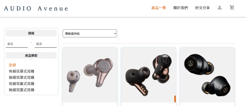
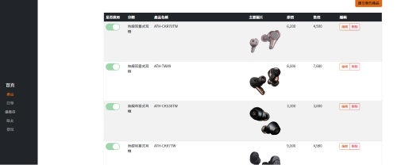

# AUDIO Avenue 耳機電商網站

以 Vue 製作的單頁式應用網站 (SPA) 包含RWD

### Demo：[線上觀看連結](https://oscar-2283.github.io/headphone/#/)





## 後台




## Recommended IDE Setup

[VSCode](https://code.visualstudio.com/) + [Volar](https://marketplace.visualstudio.com/items?itemName=Vue.volar) (and disable Vetur) + [TypeScript Vue Plugin (Volar)](https://marketplace.visualstudio.com/items?itemName=Vue.vscode-typescript-vue-plugin).

## Customize configuration

See [Vite Configuration Reference](https://vitejs.dev/config/).

## Project Setup

```sh
npm install
```

### Compile and Hot-Reload for Development

```sh
npm run dev
```

### Compile and Minify for Production

```sh
npm run build
```

### Lint with [ESLint](https://eslint.org/)

```sh
npm run lint
```

## 專案技術
- Vite 環境建置
- Vue 3 Options API
- Vue Router 建構路由
- Pinia 全局狀態管理
- 元件拆分與使用
- Vue axios 串接 RESTful API 資料
- bootstrap 完成 RWD 版型
- ESLint  + Prettier 統一程式碼結構
- Vuelidate 表單驗證、Vue-i18n
- Gsap & AOS 動畫
</br>

## Contact me 聯繫我
- Email：oscar50048@gmail.com
- Discord：DIO大人#4776
